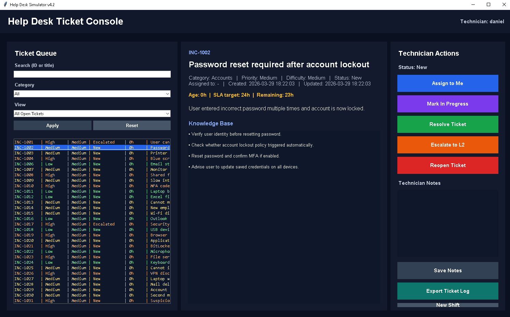

# Help Desk Simulator v4.2

A desktop-based Help Desk Ticketing System built with Python (Tkinter).  
This project simulates real-world IT support workflows including ticket management, assignment, SLA tracking, and technician actions.

## 📸 Screenshot

---

## 🚀 Features

- Ticket queue with filtering (category, assigned tickets, resolved)
- Ticket lifecycle management:
  - Assign to technician
  - In Progress
  - Resolved
  - Escalated
  - Reopen
- SLA tracking (based on priority)
- Ticket aging (hours/days)
- Overdue detection
- Technician notes system
- Knowledge Base panel
- Search (by ticket ID or title)
- CSV logging of all ticket actions
- Statistics dashboard:
  - Open
  - In Progress
  - Resolved
  - Escalated
  - Overdue

---

## 🧠 Tech Stack

- Python 3
- Tkinter (GUI)
- JSON (data storage)
- CSV (logging)

---

## 📊 How It Works

1. Start shift by entering technician name
2. Select a ticket from the queue
3. Assign ticket to yourself
4. Move through statuses (In Progress → Resolved / Escalated)
5. Add technical notes
6. System tracks SLA and logs all actions

---

## 📁 Project Structure
helpdesk-simulator/
│
├── main.py
├── tickets.json
├── ticket_log.csv
└── README.md

---

## 📌 Example Use Case

Simulates a real IT Support environment:
- diagnosing VPN issues
- troubleshooting network connectivity
- handling user access problems
- documenting solutions

---

## 🔄 Future Improvements

- Web-based version (Flask / React)
- Authentication system
- Database integration (SQLite / PostgreSQL)
- Multi-user environment

---

## 🎯 Purpose

This project was built as part of my portfolio to demonstrate:
- understanding of IT Support workflows
- problem-solving approach
- basic system design
- GUI development in Python

---

## 👤 Author

Daniel Ciok
